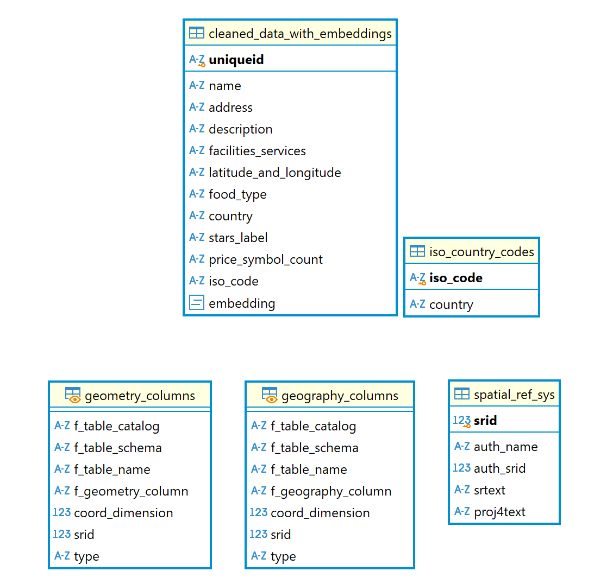

# Michelin Guide: Vector-Based Dining Finder
### Group Name: Pumpkin Pie

# Goal of the project
Are you tired of endless googling to find the fine dining experience or want to have some good quality of food? Our Michelin Guide: Vector-Based Dining Finder is designed to revolutionize the way you discover restaurants from fine dining to local food. By leveraging vector embeddings and similarity search, our tool transforms random user queries, like "truffle pasta with outdoor seating," into precise recommendations. Our project focuses on creating a vector database of Michelin-starred restaurants and descriptions, coupled with an interactive dashboard to streamline the restaurant discovery process.

# Source of dataset
Michelin Offical Websites: https://guide.michelin.com/us/en

# Scrape Data
Using the `python3 code/scrape.py` on the cmd to run the data.

## Search For Michelin Restaurants and Save Links

**Key Functions in `scrape_page.py`:**  
`scrape_page`: Scraping all links for each restaurants in one page and saving all links into a list. 
`scrape_all_pages`: Save the extracted restaurant links to a list. 

**Processing Logic:**
The HTML content of each page is parsed with `BeautifulSoup` to extract restaurant's individual links. This process is repeated across all available pages by changing the number of page one by one until no more results are found. Finally, the extracted property links are saved to a list for scraping restaurant's details.

## Extract and Save Restaurant Details

**Key Functions in `scrape_res.py` and `scrape.py`:**  
`map_client`: Set up your Google Places API Key to identify yourself while scraping and create a client to access Google Places API. 
`get_name`, `get_address`, `get_country`, `get_price`, `get_type_food`, etc: Extract all restaurant's details including name, address, country, price, type of food, Michelin stars, description, facilities and services information, and geo-location respectively from each restaurant page. \
`scrape_res`: Extract same details for each restaurant's url. 
`scrape_res_dict`: Save the extracted restaurants' details into a dictionary. 
`scrape`: Scrapes links and restaurants details and return a list of restaurants information. 

**Processing Logic:**
 Load restuarant links from saved URLs from running `python code/scrape_pages.py`. For the individual link, the corresponding page is opened, and details such as restaurant's name, prices, and geo-location are extracted. The extracted information is then saved to a list first, then save as CSV file and JSON file.
# Clean Data

Using the `python3 code/cleaned_data.py` on the cmd to run the data.

**Key Functions:** 

`load_jsonl_data`: Load the input JSONL file containing raw restaurant data into a pandas DataFrame for processing. 
`clean_name_column`: Remove non-alphanumeric characters from the restaurant names to ensure consistency. 
`extract_country_from_address`: Parse the address column to extract the country information, assuming the last word in the address represents the country. 
`fix_encoding_issues`: Correct improperly encoded text, such as "Türkiye," by re-encoding it into the proper UTF-8 format. 
`add_stars_label`: Generate a numeric column that maps Michelin star ratings to corresponding numeric labels (e.g., "Three Stars" → 3). 
`count_price_symbols`: Calculate the number of special symbols in the price column to approximate price categories. 
`drop_unnecessary_columns`: Remove redundant columns such as raw "price" and "stars" to streamline the dataset. 
`save_cleaned_data_to_csv`: Save the cleaned DataFrame to a CSV file for subsequent SQL ingestion. 

**Description**

The clean data process was a critical step in ensuring the accuracy and usability of our Michelin Guide Dining Finder. This stage involved transforming raw data into a structured, clean dataset that could be effectively used for analysis and recommendation generation.

We began by loading a raw dataset in JSONL format and converted it into a tabular format using Python's pandas library. This transformation enabled us to systematically clean and preprocess key columns. For instance, the "name," "address," and "description" columns were stripped of non-alphanumeric characters to ensure consistency. To derive meaningful insights, we also extracted additional features such as "country," which was inferred from the last part of the address field, and "stars_label," which classified restaurants based on Michelin ratings (e.g., Three Stars, Two Stars).

During the process, we noticed inconsistencies in character encoding, particularly for certain country names such as "Türkiye," which should be represented as "Türkiye." This issue was addressed by implementing a character encoding correction function that re-encoded problematic text into the proper UTF-8 format. Additionally, unmapped country names were manually corrected and aligned with their corresponding ISO standard names.

To further enhance usability, we implemented a mapping system to link countries with their ISO codes. This was achieved by leveraging an external ISO country codes dataset. For countries that were not directly matched, we created a dictionary of manual mappings to ensure full coverage. The final dataset included a new column for ISO codes, providing a standardized reference for country information.

Lastly, we added an identifier column to uniquely label each restaurant and dropped redundant fields, such as raw price and stars columns, to streamline the dataset. The final cleaned data was saved as a CSV file, ready to be utilized for vector embedding generation and cosine similarity analysis.

This clean data process was instrumental in transforming raw, unstructured data into a robust foundation for the Michelin Guide Dining Finder, ensuring accurate and efficient performance of the recommendation system.

## SQL Table and Extension ##

Copy the codes in create_table.sql to DBeaver to run the sql codes. 

**Key Functions:** 

`upload_to_postgresql`: Upload the cleaned CSV file to a PostgreSQL table for structured storage and querying. 
`install_pgvector_extension`: Install the pgvector extension in the PostgreSQL environment to enable native support for vector computations. 

**Description**

Following the data cleaning process, the refined dataset was uploaded to a PostgreSQL database to facilitate efficient storage and querying. This step was crucial for enabling advanced vector-based similarity searches in the Michelin Guide Dining Finder.

The dataset was structured into a SQL table, ensuring proper normalization and alignment with relational database best practices. Each column of the table represented key attributes of the cleaned dataset, including the unique identifier, restaurant name, address, description, food type, stars label, ISO country code, and latitude and longitude information. This organization allowed for efficient querying and seamless integration with vector similarity operations.

To enable vector-based computations, we installed the pgvector extension in PostgreSQL. This extension provides native support for storing and querying vector embeddings within the database. By leveraging pgvector, we could store dense vector embeddings directly in the database, enabling efficient similarity searches using cosine distance.

The installation of the pgvector extension was straightforward, requiring the execution of the following command in the PostgreSQL environment:

CREATE EXTENSION IF NOT EXISTS vector;

Once the extension was installed, a new column was added to the SQL table to store the vector embeddings. These embeddings were generated using a pre-trained Sentence Transformer model and represented restaurant reviews in a 384-dimensional vector space. The database schema was updated to accommodate the new column, ensuring compatibility with the vector operations provided by pgvector.

The use of PostgreSQL with the pgvector extension ensured that the Michelin Guide Dining Finder was equipped with a robust and scalable backend, capable of performing complex vector similarity searches efficiently. This setup formed the backbone of our recommendation system, allowing us to deliver personalized restaurant suggestions to users.

The following Entity-Relationship (ER) diagram illustrates the schema design for the Michelin Guide Dining Finder database. It highlights the relationships between the key tables: cleaned_data_with_embeddings and iso_country_codes. The cleaned_data_with_embeddings table stores detailed information about restaurants, including their names, addresses, food types, and vector embeddings for review analysis. The iso_country_codes table provides a reference for standardized country codes, ensuring accurate mapping and consistency across the dataset. This structure enables seamless integration of data for efficient querying and vector-based similarity searches, forming the foundation of the recommendation system.

# Sentence-Transformers and Pgvector

## Embedding

Using the `python3 code/embedding.py` on the cmd to run the data.

### **Key Functions:** 
`load_model`: Load the pre-trained `all-MiniLM-L6-v2` model to generate text embeddings. 

`load_csv`: Load the `cleaned_data.csv` file from the artifacts directory and ensure the file exists. 

`validate_column`: Check whether the specified description column exists in the DataFrame loaded from `cleaned_data.csv`. 

`generate_embeddings`: Generate sentence embeddings for the description column in `cleaned_data.csv` using the `all-MiniLM-L6-v2` model and store them in a new column named `embedding`. 

`save_csv`: Save the updated DataFrame, including the new embedding column, to the `cleaned_data_with_embeddings.csv` file in the artifacts directory. 

`process_csv_with_embeddings`: Integrate all steps to load `cleaned_data.csv`, validate its structure, generate embeddings for the description column, and save the processed file as `cleaned_data_with_embeddings.csv` in the artifacts directory. 

### **Description：** 
This script is designed to process textual data from a CSV file and enhance it with sentence embeddings using a pre-trained model. It begins by loading the `all-MiniLM-L6-v2` model, which specializes in generating embeddings for text descriptions.  

Next, it reads the `cleaned_data.csv` file from the `artifacts` directory, ensuring the file exists before proceeding. Once the file is loaded, the script validates that the necessary `description` column is present in the dataset, as this column contains the text data to be processed. For each entry in the `description` column, the script generates a sentence embedding using the loaded model and stores the results in a new column named `embedding`.  

After processing all rows, the updated data is saved to a new file, `cleaned_data_with_embeddings.csv`, in the same `artifacts` directory. The entire process, from loading the file to saving the enhanced data, is streamlined through a single function, ensuring the workflow is both efficient and easy to manage.

## Match SQL with pgvector

Using the `python3 code/match_sql.py` on the cmd to run the matching logic.

### **Key Functions:**  

`__init__`: Initialize the `RestaurantMatcher` class by setting up a database connection with `SQLAlchemy` and loading the `all-MiniLM-L6-v2` model for text embeddings. 

`match`: Generate an embedding for the user query and use `pgvector` in the database to find the top 20 restaurants with similar embeddings. The similarity is calculated using cosine distance, and results are filtered to include only restaurants with a similarity score above 0.5. This function queries the database table `cleaned_data_with_embeddings`. 

`update_embeddings`: Calculate new embeddings for the descriptions in the CSV file `cleaned_data.csv` (stored in the artifacts directory) and update the `cleaned_data_with_embeddings` table in the database with the new embeddings. 

`run_match_query`: Execute the match function with a user query, handle potential exceptions, and print the matching results. 

### **Description：** 
This script enables efficient restaurant matching based on textual similarity, using a combination of sentence embeddings and database queries. It begins by initializing the RestaurantMatcher class, which sets up the required `SQLAlchemy` engine and loads the `all-MiniLM-L6-v2` model for embedding generation.

The core functionality is provided by the match method, which takes a user query as input, generates a sentence embedding, and queries a PostgreSQL database equipped with `pgvector`. This query returns the top 20 restaurants from the `cleaned_data_with_embeddings` table with the highest similarity scores, provided the similarity is above 0.5. The results include essential restaurant details like uniqueid, name, address, country, stars_label, and similarity.

Additionally, the update_embeddings function allows updating the embeddings in the `cleaned_data_with_embeddings` table with new data from the CSV file `cleaned_data.csv`, ensuring the system stays current. For ease of use, the `run_match_query` function integrates the matching logic and prints the results, making it convenient to test or use interactively. The entire workflow is optimized for matching restaurants based on user input with high accuracy and relevance.

# Visualization And Findings #

## Visualization ##
Using the `streamlit run app.py` on the cmd to run the app.

## Overview
The Michelin Restaurant Finder is an interactive platform designed to explore and analyze Michelin-starred restaurants worldwide. With data-driven filtering, keyword-powered search, and geospatial visualizations, this tool provides a seamless experience for users interested in discovering high-quality dining options. Users can interactively filter restaurants by country, cuisine type, price range, and star rating.

## World Map Visualization
  
Displays Michelin-starred restaurants worldwide.Interactive hover feature shows the number of restaurants by country, along with their star distributions (0-star to 3-star).

**Key Functions:**  
`run_query()` : to connect to the database and retrieves required data. 
`create_map()`: the core function of the script, responsible for querying data from a database and saving the results as a CSV file. 
`c.iso_code`and`c.country`:to group data by country and ISO codes  
`hover_text`: to custom hover templates and dynamic integration with Streamlit for real-time exploratio 

## Dynamic Filtering
  
Filter restaurants based on:
Star Rating; Country; Cuisine Type; Price Range

**Key Functions:**  
`get_filter_options()`: to execute a SQL query to fetch unique values for stars_label, country, and food_type from the database  
`st.dataframe()` : to ensure its displayed as an interactive table in the Streamlit app 

## AI-Powered Keyword SearchAI 
  
Combines keyword-based searches with an AI recommendation system to find restaurants matching specific descriptions (e.g., "delicious seafood restaurant"). 

**Key Functions:**  
`st.text_input()`: for users to input a search query that describes their restaurant preferences 
`RestaurantMatcher.match()`: function processes the query to find restaurants matching the input using AI  
`st.dataframe()`: to displays the formatted DataFrame with restaurant search results in an interactive table  
`matcher.match()`: method processes the query using AI or natural language processing to find relevant results. 

## Interactive Map with Nearest Restaurants

**Key Functions:**  
`interactive_map`: Main function to display an interactive map with Michelin restaurants and compute nearest restaurant information.
`query_data`: Query restaurant data and convert it into a GeoDataFrame for spatial analysis.
`get_nearest_restaurants`: Calculate the nearest restaurants to a user-selected point on the map using geometric distance computations.

**Processing Logic:** 
The `interactive_map` function extracts restaurant details, including geographic coordinates, via the `query_data` function. This data is converted into a GeoDataFrame, leveraging its geometry support for spatial computations. An interactive map is generated using Folium, where each restaurant is represented as a marker. When a user clicks on a point on the map, `get_nearest_restaurants` computes the 10 closest restaurants using spatial distance calculations provided by the GeoDataFrame's geometry. The results are displayed in a sorted table by star rating, providing users with an intuitive and interactive experience.

  

 

# Limitation

1. Vector Search Limitations: 
The current vector search relies on 384-dimensional embeddings generated by Sentence Transformers and PGVector. This dimensionality may result in better performance for multi-word queries compared to single-word queries, limiting the consistency of results across varying query lengths. 
2. Limited Full-Text Search Data: 
The dataset used for full-text search is relatively small, which restricts the diversity and richness of search results.

 

#  Further Research
1. Enhancing the Machine Learning Model: 
Experiment with machine learning models that support higher-dimensional vector representations to capture more intricate relationships and subtle nuances in the data. Incorporate advanced pre-trained language models (e.g., BERT or GPT-based embeddings) to enhance the quality and relevance of AI-powered search results. 
2. Expanding the Dataset: 
Integrate Google Reviews into the dataset to provide more context and enrich the information available for search and machine learning functionalities. Include data from other restaurant ranking systems or user-generated platforms, creating a more comprehensive and versatile dataset. 
3. Real-Time Data Updates: 
Develop automated ETL (Extract, Transform, Load) pipelines to regularly update Michelin data. This ensures the application always reflects the most current and accurate restaurant information. 
4. Geographic Expansion: 
Extend the dataset to include restaurants from regions not covered by the Michelin Guide, leveraging alternative restaurant evaluation platforms or open data sources to broaden geographic coverage. 
 

